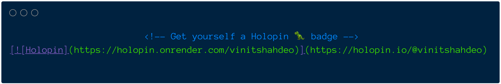

<div align='center'>
  
  <h1>Holopin <code>README</code> Badge
  </h1>
  <p><strong>Get yourself a Holopin markdown badge to show your collection of badges 🦖</strong><br/>
  <sup>Start collecting <a href='https://www.holopin.io/'>digital badges on Holopin</a> if you haven't yet!</sup><br/>
  </p>
  
  <br/><br/>
</div>

Holopin is a platform that allows you to create and collect digital badges that people love ━ **this is for you if you love collecting badges**. Here's my collection ━ [holopin.io/@vinitshahdeo](https://www.holopin.io/@vinitshahdeo). Read "[Introducing Holopin: the digital badge platform for developers!](https://dev.to/elenalape/introducing-holopin-the-digital-badge-platform-for-developers-2hlk)" by [@elena_lape](https://twitter.com/elena_lape) to learn more.



While Holopin already provides badge boards that can be easily embedded on GitHub and GitLab. **You can now also add markdown badges to your READMEs.** It's always **recommended** to [embed badge board](https://blog.holopin.io/posts/website-embed-tutorial) which is officially provided by Holopin ⎯ **use it like your laptop stickers**; but if you want to use a tiny badge, here's how! 

> My gratitude to the Holopin team for [featuring me among the first four **Holopals**](https://blog.holopin.io/posts/holobytes-and-holopals).

## Here's how?
Replace `vinitshahdeo` in the markdown with your Holopin username. [Start collecting digital badges on Holopin](https://www.holopin.io/) if you haven't yet!

[](https://holopin.io/@vinitshahdeo)

```markdown
[](https://holopin.io/@vinitshahdeo)
```

For using HTML, please replace `vinitshahdeo` with your Holopin username in the syntax below:

```html
<a href='https://holopin.io/@vinitshahdeo'>
    
</a>
```

## Style your badge 🦖

Additionally it supports the styles. **To use a different style**: Replace `flat-square` in the markdown with any of the styles below ⤵

> **Note** `flat` is the default style.

```markdown

```

### Available styles

| Style | Badge | 
|:---|:---|
| `flat` |  | 
| `flat-square`  |   |
| `plastic`  |   | 
| `social`  |   | 
| `for-the-badge`  |   |

## Build locally

```console
npm install
npm start
```

Run the above command and visit `http://localhost:3000/`

## API Documentation

You can find the [API Documentation on Postman](https://www.postman.com/restless-rocket-22186/workspace/holopin-badges/documentation/6178851-36f7e660-f5bf-46bc-9e45-10c21fe82cb0) or simply embed the collection using the below button:

[](https://god.gw.postman.com/run-collection/6178851-36f7e660-f5bf-46bc-9e45-10c21fe82cb0?action=collection%2Ffork&collection-url=entityId%3D6178851-36f7e660-f5bf-46bc-9e45-10c21fe82cb0%26entityType%3Dcollection%26workspaceId%3D60e2f805-1bca-4052-8f4c-5b565f12e19f#?env%5BHolopin%20Badges%20on%20Render%5D=W3sia2V5IjoiYmFzZV91cmwiLCJ2YWx1ZSI6Imh0dHBzOi8vaG9sb3Bpbi5vbnJlbmRlci5jb20iLCJlbmFibGVkIjp0cnVlLCJ0eXBlIjoiZGVmYXVsdCJ9XQ==)

## Contributing

Do you want to pitch in? If so, please consider developing a web app that generates the markdown badge dynamically based on the Holopin username entered by the user. There will be an option to copy the markdown text. You can take inspiration from the [Topmate Badge Generator](https://topmate-readme-badge.netlify.app/).

**Quick start**

```bash
git checkout feature/web-app
cd client
npm install
npm start
```

> **Note** Please checkout [issue #2](https://github.com/vinitshahdeo/holopin-readme-badge/issues/2)

## Under the hood
  
This is powered using an [Express](https://expressjs.com/) app which is hosted on [Render](https://render.com/), a cloud Application hosting provider for Developers! Huge shout-out to [Shields.io](https://shields.io/) service for providing badges in the SVG format.


## Badge board

Holopin Badge Board can directly be embedded into your GitHub/GitLab READMEs. Learn more [here](https://blog.holopin.io/posts/github-readme-tutorial). You can find my collection ⎯ [holopin.io/@vinitshahdeo](https://www.holopin.io/@vinitshahdeo). Below is my board 🦖

[](https://holopin.io/@vinitshahdeo)

## Support

```javascript
if (this.isAwesome()) {
  support(⭐); // consider leaving a star
}

fork(🖥️) && contribute(🚀); // raise your PR to make it better
```

Glad to see you here! Did you love it? Show your support by [leaving a star](https://github.com/vinitshahdeo/holopin-readme-badge/stargazers) or sharing your thoughts on [Twitter](https://twitter.com/Vinit_Shahdeo).

[](https://twitter.com/intent/tweet?url=https%3A%2F%2Fgithub.com%2Fvinitshahdeo%2Fholopin-readme-badge%2F&via=vinit_shahdeo&text=Get%20yourself%20a%20Holopin%20README%20Badge%21&hashtags=holopin%2Creadme%2Cbadge%2Copensource)

## Similar projects

☆ [Peerlist README Badge](https://github.com/vinitshahdeo/peerlist-readme-badge) ⎯ Peerlist [profile](https://peerlist.io/vinitshahdeo) can be used as a **simple resume** or a **complete portfolio** to showcase your work. You can style your `README` with an awesome Peerlist markdown badge.

☆ [Topmate README Badge](https://www.producthunt.com/products/topmate-io-readme-badge-generator) ⎯ Topmate is a platform to **connect 1:1 with your audience** & monetise your time better. Basically, [one link](https://topmate.io/vinitshahdeo) to do it all. Even better, you can now add a markdown badge in your GitHub profile `README` to connect with your community! 


<div align='center'>
   <br/>
   <br/>
   ⎯⎯⎯⍟✪⍟⎯⎯⎯
   <br/>
   <strong>Made with ♡ by <a href='https://github.com/vinitshahdeo'>@vinitshahdeo</a> for <a href='https://www.holopin.io/@vinitshahdeo'>Holopin.io</a></strong><br/>
   <sup>✨Collect <a href='https://www.holopin.io/'>your digital badges</a> on Holopin!✨</sup><br/><br/>
   <a href='https://twitter.com/Vinit_Shahdeo'></a>
   <br/>
   <br/>
</div>
